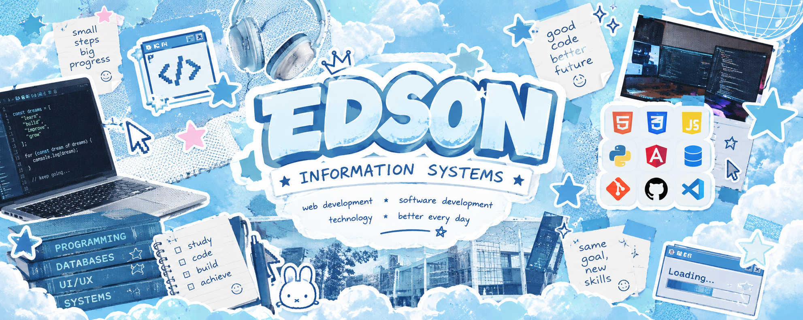

 

### ☁️ Estudante de Sistemas de Informação · Explorando Tecnologia ☁️

 

 

---

## ☁️ Sobre mim

 

Sou estudante de **Sistemas de Informação na UNIJORGE** e estou
explorando diferentes áreas da tecnologia e do desenvolvimento de software.

Tenho conhecimentos básicos em **Python e SQL** e, atualmente,
tenho bastante interesse em **desenvolvimento Front-end, UI/UX
e criação de interfaces digitais**.

Neste momento, estou focado em aprender, desenvolver projetos
e experimentar diferentes tecnologias enquanto descubro a área
da tecnologia em que quero me desenvolver profissionalmente.

 

`🎓 Estudante`　`💻 Tecnologia`　`🎨 UI/UX`　`🌐 Front-end`

 

---

## 🩵 Tecnologias & Ferramentas

 

 

---

## ✦ Atualmente explorando ✦

 

<table align="center">
<tr>
<td align="center" width="200">

### 🌐

**Front-end**

Explorando desenvolvimento  
de interfaces para web.

</td>

<td align="center" width="200">

### 🎨

**UI/UX**

Aprendendo sobre interfaces,  
experiência e design.

</td>

<td align="center" width="200">

### 🐍

**Python**

Fortalecendo minha base  
em programação.

</td>

<td align="center" width="200">

### 🗄️

**SQL**

Aprendendo mais sobre  
bancos de dados.

</td>
</tr>
</table>

 

---

## ⭐ Projetos

 

<table>
<tr>

<td width="50%" valign="top">

### 📓 Agenda UNIJORGE

Projeto acadêmico desenvolvido durante o curso de
Sistemas de Informação.

**Tecnologias**

`Angular` `TypeScript` `HTML` `CSS`

 

[→ Ver projeto](#)

</td>

<td width="50%" valign="top">

### 💻 Outros projetos

Projetos desenvolvidos durante meus estudos,
explorando programação, web e diferentes tecnologias.

**Em construção...**

`Python` `JavaScript` `SQL`

</td>

</tr>
</table>

 

---

## 📚 Minha jornada

 

☁️ **Aprender**　→　⭐ **Experimentar**　→　💻 **Construir**　→　🩵 **Evoluir**

 

> *Ainda estou descobrindo qual caminho seguir na tecnologia —
> e tudo bem. Por enquanto, estou aproveitando o processo de aprender.*

 

---

## 📊 GitHub

 

 

 

---

## 📎 Entre em contato

 

  

☁️　⭐　☁️　⭐　☁️

 

Aprendendo, construindo e descobrindo meu caminho na tecnologia.

